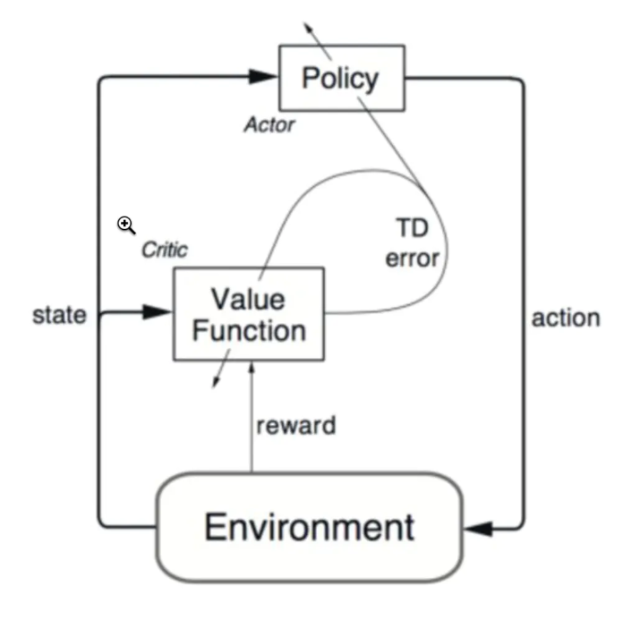

# Tars-Go Robomaster决策组强化学习程序

```
强化学习/
├──environment.yaml                             #python依赖模块
├──ICRA_save.model                              #保存和读取的模型
├──run.sh                                       #快速训练测试脚本
├──simulator.py                                 #包含主要的操作（步长）和参数（惩罚因子）设置
├──test.py                                      #测试启动函数
├──train.py                                     #训练启动函数
├──utils.py                                     #机器人初始化参数设置
├──关键参数.md                                   #关键参数介绍
├─agent                                         #敌方机器人操作设置
│  ├──AC.py                                     #AC算法参数设置
│  ├──hand.py                                   #人工控制设置
│  ├──model.py                                  #模型网络
│  ├──move.py                                   #移动参数设置
├─archieved                                     #具体实现
│  ├── Astar.py                                 #A*算法
│  ├── DynamicWindow.py                         #可视化界面
│  ├── GlobalLocalPlanner.py                    #全局规划
│  ├── MoveAction.py                            #移动设置
│  ├── NaiveMove.py                             #位移和奖惩操作
│  ├── visual_traj.py                           #移动轨迹可视化
├─battlefield                                   #全图设置
│  ├─body                                       #障碍物，子弹，机器人设置
│  │  │──obstacle.py                            #障碍物参数
│  │  │──projectile.py                          #子弹参数和射弹设置
│  │  │──robot.py                               #机器人参数
│  ├─referee                                    #场地和机器人其他设置
│  │  │──buff.py                                #加成惩罚区设置
│  │  │──contact.py                             #友方信息共享设置
│  └─sensor                                     #传感器设置
│     │──capture.py                             #雷达和碰撞检测
├─img
│  ├─loss.pdf                                   #模型训练损失
│  ├─AC.PNG                                     #AC算法模型
```
## 依赖
详情见：environment.yaml

## 安装
1.下载anaconda
2.在强化学习目录下，进入终端（Ubuntu）或者cmd（Windows）输入`conda env create -f environment.yaml`


## 内容简述

软件根据真实机器人枪口，炮管，车身尺寸和地图信息进行仿真。 双机对抗过程中我方两车可进行信息交互，互相获取血量，位置，姿态等信息，根据双车信息进行双车路径规划（躲避障碍物和惩罚区）以及决策行动（获取buff，追击敌人，躲避防御）。在敌方车进入我方视野后可以获取到敌方位置，姿态等信息，并可以进行联合追击敌方一车，掩护友方获取buff。

## 软件系统框图所示：



## AC算法原理
Actor-Critic Actor-Critic算法分为两部分，actor的前身是policy gradient，它可以轻松地在连续动作空间内选择合适的动作，value-based的Q-learning只能解决离散动作空间的问题。但是又因为Actor是基于一个episode的return来进行更新的，所以学习效率比较慢。这时候我们发现使用一个value-based的算法作为Critic就可以使用TD方法实现单步更新，这其实可以看做是拿偏差换方差。这样两种算法相互补充就形成了我们的Actor-Critic。Actor来选择动作，Critic来告诉Actor它选择的动作是否合适。在这一过程中，Actor不断迭代，得到每一个状态下选择每一动作的合理概率，Critic也不断迭代，不断完善每个状态下选择每一个动作的奖惩值。


## 软件测试步骤

### 快速训练+测试

直接运行run.sh

### 单独训练

* 运行`train.py`

### 单独测试

* 运行`test.py`


## 遵循设计模式

单例模式
